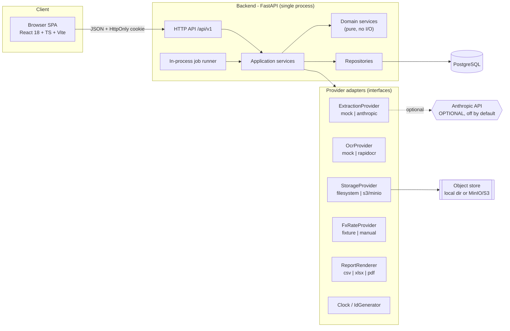
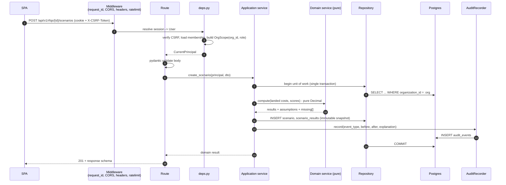

# 01 - System Architecture

Status: **DRAFT**
Scope: whole system. Authority: `docs/SPEC.md` overrides this document wherever they disagree.
Audience: principal engineer (decisions), junior implementers (boundaries).

---

## 1. Architectural goals, in priority order

1. **Correctness of money.** Exact decimal arithmetic, reproducible results, honest missing-data
   semantics. A wrong number that looks confident is the worst possible failure of this product.
2. **Provable organization isolation.** Cross-org read or write must be impossible, and that must be
   demonstrable by an automated test that enumerates every route.
3. **Determinism and reproducibility.** Same inputs ⇒ same outputs, including the solver, including
   after assumptions change (historical scenarios re-open unchanged).
4. **Explainability.** Every number carries its inputs, formula, assumptions, source, version.
5. **Zero-cost demo.** Full workflow runs with no paid API key, no network egress, no Docker.
6. **Junior-implementable.** Thin, obvious layers; heavy logic in pure functions; contracts owned by
   the maintainer.

Non-goals for v0.1.0: horizontal scale, multi-region, real-time collaboration, SSR/SEO, mobile apps,
streaming AI UX, tenant-configurable schemas.

---

## 2. Context diagram



**Everything crossing a boundary into `Providers` is replaceable and mocked by default.** The demo
and the entire automated test suite run with `EX=mock`, `OCR=mock`, `ST=filesystem`, `FX=fixture`.

---

## 3. Layering rules (enforced, not aspirational)

SPEC request flow: `API route → application service → domain service → repository → PostgreSQL`.

| Layer | Package | May import | May NOT do |
|---|---|---|---|
| Route | `app/api/v1/**` | schemas, application services, deps | business rules, SQL, Decimal math |
| Schema | `app/schemas/**` | pydantic, domain enums | I/O, ORM models |
| Application service | `app/services/**` | domain, repositories, providers, uow | raw SQL, HTTP concerns, `Request` |
| Domain service | `app/domain/**` | stdlib, `decimal`, domain types | DB, network, filesystem, clock, uuid4 |
| Repository | `app/repositories/**` | models, sqlalchemy | business rules, provider calls |
| Model | `app/models/**` | sqlalchemy | anything else |
| Provider | `app/providers/**` | its SDK | domain rules |

Two rules that matter more than the rest:

- **`app/domain/**` is pure.** No `datetime.now()`, no `uuid4()`, no session. Time and identity are
  injected (`Clock`, `IdGenerator`). This is what makes "financial calculations testable without a
  database" (SPEC §Technical architecture) true rather than claimed.
- **Repositories are the only place a table is touched, and every repository method takes an
  `OrgScope`.** See §7.

Enforcement: an import-linter contract in CI (`lint-imports`) plus a unit test that greps
`app/domain` for `datetime.now|utcnow|uuid4|Session|requests|httpx`.

---

## 4. Backend package layout

```
backend/
  pyproject.toml            # uv-managed, [project] + [tool.*]
  alembic.ini
  migrations/               # alembic versions
  src/app/
    main.py                 # app factory, middleware, router mounting
    core/                   #
      config.py             #   pydantic-settings, typed env
      security.py           #   argon2, session tokens, CSRF, constant-time cmp
      errors.py             #   AppError hierarchy -> HTTP problem shape
      logging.py            #   structured JSON logs + request_id
      money.py              #   Decimal context, quantize helpers, Money type
      clock.py              #   Clock protocol, SystemClock, FrozenClock
      ids.py                #   IdGenerator protocol
    api/
      deps.py               # : auth, current_user, OrgScope, role guard
      v1/                   # one module per resource
    schemas/                #  for shared/base; per-resource routine
    services/               # application services (orchestration + transactions)
    domain/
      landed_cost/          #  interfaces, routine internals
      scoring/
      optimization/
      matching/
      units/
      fx/
    repositories/
      base.py               # : OrgScopedRepository
    models/                 #  base + mixins; per-table routine
    providers/
      extraction/  ocr/  storage/  fx/  reports/
    jobs/                   # job table + runner
    seed/                   # synthetic dataset builder
    exports/                # csv/xlsx/pdf renderers
  tests/
    unit/ integration/ contract/ fixtures/
frontend/
docs/
docker-compose.yml
.github/workflows/
```

Agreed with the maintainer's §6 layout. Additions proposed: `app/core`, `app/jobs`, `app/exports`,
`app/seed`. `app/core` in particular is the natural home for the cross-cutting primitives the
principal wants to own; without it those primitives get scattered and drift.

---

## 5. Request flow (typical write path)



**Transaction rule:** one HTTP request = at most one DB transaction, opened and committed by the
application service via a Unit of Work dependency. Repositories never commit. Audit events are
written **inside** the same transaction as the change they describe - an audit trail that can
diverge from the data is worse than none.

**Provider rule:** never call a network provider inside an open transaction. Extraction is a job
(§6), not an inline call.

---

## 6. Asynchronous work - a gap in the provisional decisions

Extraction of a scanned PDF, XLSX parsing, PDF report rendering and optimization runs are all
seconds-to-tens-of-seconds. The provisional decisions do not name a job strategy. Celery/RQ need
Redis; Redis needs Docker; the maintainer's machine has no Docker. Recommendation:

- A `jobs` table (id, org_id, kind, state, payload, attempts, locked_by, locked_until, result_ref,
  error, timestamps) as the single source of truth.
- Default execution: **in-process worker thread pool** started on FastAPI lifespan, polling `jobs`
  with `SELECT ... FOR UPDATE SKIP LOCKED`. No broker, no Docker, works identically in CI.
- `JOB_RUNNER=inline` mode for tests: the job executes synchronously inside the request so tests
  stay deterministic without sleeps/polling.
- A separate `python -m app.jobs.worker` entrypoint exists from day one so the same code scales out
  later. Documented as roadmap, not claimed as production-proven.

API contract consequence: expensive POSTs return `202 Accepted` with a job resource
(`/api/v1/jobs/{id}`); the SPA polls with TanStack Query. This is spelled out in `03-api-contract.md`.

---

## 7. Organization isolation - defense in depth

The ruling ("mandatory `organization_id` filter in the repository layer") is necessary
but is a *single* control that fails silently the first time someone writes a raw query or forgets a
filter on a join. Proposed layering:

| # | Control | Where | Failure mode it catches |
|---|---|---|---|
| 1 | `OrgScope` value object, constructible only from an authenticated principal + verified membership | `api/deps.py` | forged/absent org id in request body |
| 2 | `OrgScopedRepository` base: every query builder starts from `.where(Model.organization_id == scope.org_id)`; a `get()` that returns a row with a different org raises `OrgIsolationViolation` (defensive assertion, logged as a security event) | `repositories/base.py` | forgotten filter in a subclass |
| 3 | **Composite foreign keys carrying `organization_id`** - e.g. `rfq_lines(organization_id, rfq_id) REFERENCES rfqs(organization_id, id)` | schema | cross-org *references* created by any code path, including seeds and migrations |
| 4 | Route-matrix isolation test: enumerate `app.routes`, and for each, call it as an actor from org B against a fixture resource in org A; assert 404 (not 403 - do not confirm existence) | `tests/integration/test_org_isolation_matrix.py` | new endpoints added without isolation |
| 5 | *(Phase 7, optional)* Postgres RLS with `SET LOCAL app.current_org_id` per request | DB | ORM bypass, ad-hoc SQL |

Control 3 is the one I most want the maintainer to adopt: it moves isolation from "every developer
remembers" to "the database refuses". It costs one extra `UNIQUE (organization_id, id)` per table and
a two-column FK. Control 5 is genuinely stronger still but complicates migrations, seeding and
superuser connections; I recommend documenting it as hardening rather than blocking v0.1.0 on it.

**Not-found policy:** cross-org access returns `404`, never `403`. `403` leaks existence.

---

## 8. Provider abstractions

| Interface | Default (demo/tests) | Optional real | Notes |
|---|---|---|---|
| `ExtractionProvider` | `MockExtractionProvider` - keyed by document SHA-256 → committed fixture JSON | Anthropic | Mock is *deterministic*, not random. Response labelled `simulated=true` end-to-end. |
| `OcrProvider` | `MockOcrProvider` (fixture text per image hash) | `rapidocr-onnxruntime` | See §9 - tesseract is rejected: it needs a system binary and the dev machine has no Homebrew. |
| `StorageProvider` | `FilesystemStorage` under `var/storage/` | `S3Storage` (boto3 → MinIO/S3) | Same key scheme both ways. Never expose raw paths/URLs; downloads stream through an authorized endpoint. |
| `FxRateProvider` | `FixtureFxProvider` (committed synthetic table) | `ManualOverrideProvider`, future live | Tests never touch the network (SPEC §9). |
| `ReportRenderer` | ReportLab PDF / openpyxl XLSX / csv | - | See §9 for the licence trap. |
| `Clock`, `IdGenerator` | `FrozenClock`, `SeededIdGenerator` in tests | system | **Proposed addition.** Without these, snapshot tests of reports and scenarios are unstable. |
| `AiNarrativeProvider` | `TemplateNarrativeProvider` (deterministic templates) | Anthropic | **Proposed addition.** The negotiation brief needs prose in demo mode too; do not overload `ExtractionProvider`. |

Every provider is selected by a single typed setting and exposed through a tiny registry in
`app/providers/__init__.py`. `Settings.ai_mode` must be surfaced in `GET /api/v1/meta` so the UI can
display "Simulated AI" honestly (SPEC §External-service strategy: *never present a mock response as
live*).

---

## 9. Library selection under the environment constraints

The dev machine has **no Docker, no Homebrew, no Node, Python 3.9 system-only**. Anything that needs
a system binary is effectively unavailable to the maintainer and is a footgun for contributors.
This eliminates several otherwise-obvious choices:

| Need | Choose | Reject, and why |
|---|---|---|
| PDF text + tables | `pypdf` (text), `pdfplumber` (tables) | - |
| PDF → raster (scanned quotes, page previews) | **`pypdfium2`** (BSD-3/Apache-2, pip wheels incl. macOS arm64, no system deps) | `pdf2image` (needs poppler binary → Homebrew). **`PyMuPDF` - rejected: AGPL-3.0.** The SPEC ships an MIT repo; AGPL in a distributed web app is a licence conflict, and this is easy to walk into by accident. |
| PDF report generation | **`reportlab`** (BSD-style, pure pip) | `WeasyPrint` (cairo/pango/gobject system libs → Homebrew). Headless-Chrome printing (needs a browser at runtime). |
| OCR | `rapidocr-onnxruntime` as an *optional extra*; mock by default | `pytesseract` (tesseract binary), `easyocr` (torch, ~2 GB) |
| XLSX read/write | `openpyxl` with `read_only=True`, `data_only=True` | pandas (heavy; and `data_only` semantics matter more than DataFrames here) |
| Fuzzy matching | `rapidfuzz` (MIT, wheels) | `fuzzywuzzy` (GPL'd Levenshtein path) |
| Password hashing | `argon2-cffi` directly | `passlib` (maintenance risk; bcrypt backend version friction) |
| Local Postgres for the maintainer | `pgserver` pip package (real user-space Postgres) | Docker Compose (unavailable), `testing.postgresql` (unmaintained) |
| Postgres driver | `psycopg[binary]` v3, sync | `psycopg2-binary` (older), asyncpg (not needed, see §10) |

`docker-compose.yml` (Postgres + MinIO) remains the **documented standard path** for other developers
and mirrors CI. The no-Docker local path is an explicitly supported alternative, and the two must
resolve `DATABASE_URL` through the same code path - see `08-test-strategy.md` §4.

Every dependency choice above must be recorded with its licence in `docs/DEPENDENCIES.md` and
checked in CI (`pip-licenses --fail-on 'AGPL*;GPL-3.0*'`).

### 9.1 Conflict found with the approved design direction

`design-system/procurement-optimizer/MASTER.md` (added to the repo during this planning session)
specifies Lexend + Source Sans 3 loaded via a **Google Fonts CDN `@import`**. That conflicts with two
commitments in this plan and must be resolved before Phase 1 frontend work:

- the strict CSP of `07-security-model.md` §7 (`style-src 'self'`, no external hosts) would block it;
- the demo and E2E suite are required to run with **no network egress** - a CDN font makes the demo
  render differently offline and leaks visitor IPs to a third party.

**Recommendation:** keep the exact typefaces, self-host them. `@fontsource/lexend` and
`@fontsource-variable/source-sans-3` are npm packages under the SIL Open Font License; they are
bundled by Vite, subset-able, and require no CSP relaxation. This is a one-line change now and a
CSP-weakening argument later.

Second, smaller discrepancy: the design system bands extraction confidence at `≥ 0.9 / 0.6-0.9 / < 0.6`
while `04-document-pipeline.md` §7 uses `≥ 0.95 / 0.60-0.95 / < 0.60`. The two must be reconciled to a
single source of truth (I recommend the stricter 0.95, with the critical-field override that makes the
exact threshold largely moot for money fields). Whichever is chosen, the band boundaries belong in one
backend constant that the design tokens reference, not in two documents.

---

## 10. Critique of the maintainer's provisional decisions

Format: **AGREE** / **AGREE WITH CHANGES** / **DISAGREE**, with reasons.

### D1 - FastAPI, SQLAlchemy 2.x typed, sync engine, Alembic, Pydantic v2, Python 3.12
**AGREE WITH CHANGES.** Sync is the right call: this workload is CPU-bound decimal math and short
transactional queries, and sync SQLAlchemy is dramatically easier for junior implementers to get
right (no accidental awaits, no greenlet errors, real stack traces). The change I insist on:

- **All route handlers touching the DB must be `def`, not `async def`.** FastAPI runs `def` handlers
  in a threadpool; a sync DB call inside an `async def` handler blocks the event loop for every user.
  This single mistake is the most likely way the sync decision turns into a production embarrassment.
  Enforce with a unit test that inspects the router and asserts no `async def` handler depends on
  `get_db`.
- Set `pool_size`/`max_overflow` ≥ the threadpool size (`anyio` default 40) or requests will queue on
  the pool invisibly. Recommend `pool_size=10, max_overflow=20` + threadpool capped to 20 explicitly.
- `sessionmaker(expire_on_commit=False)`, `Mapped[]`/`mapped_column()` typing everywhere,
  `DeclarativeBase` with a shared `OrgOwnedMixin` / `TimestampMixin` / `SoftDeleteMixin`.
- Python 3.12 agreed (3.13 buys nothing here and risks wheel gaps for onnxruntime/ortools on arm64).
- Add `pydantic-settings` for typed config with fail-fast validation at startup.

### D2 - Decimal end-to-end; `NUMERIC(18,6)` money, `NUMERIC(18,8)` FX
**AGREE WITH CHANGES.** Decimal end-to-end: unreserved agreement, and the DB must never see a float.
Two changes:

- **FX scale 8 is too small.** Rates like JPY→USD (0.0063…), IDR, VND, KRW lose material relative
  precision at 8 dp, and any inverse rate compounds it. Use **`NUMERIC(24,12)`** for rates. It costs
  nothing and removes an entire class of "off by a cent on large orders" bugs.
- **Separate the money scales by role.** `NUMERIC(18,6)` is right for *totals*. Unit prices for
  low-value components (fasteners, resistors quoted per 1000) routinely carry more than 6 dp of
  meaning; use `NUMERIC(18,8)` for `unit_price`-class columns and keep `NUMERIC(18,6)` for extended
  and total amounts. Both are documented in the quantization policy (`05-calculation-methodology.md`).
- Add `CHECK (scale/sign)` constraints and a `currency CHAR(3)` + ISO-4217 check everywhere an amount
  lives. An amount column without a currency column next to it is a bug waiting to happen.
- Enforce the Decimal context centrally (`app/core/money.py`, prec=34) and ban `float(` in
  `app/domain` via lint.

### D3 - OR-Tools CP-SAT with integer scaling
**AGREE WITH CHANGES**, and the changes are load-bearing for the SPEC's determinism promise:

- **CP-SAT is not deterministic with default parameters.** Multi-worker search returns different
  (equally optimal) solutions run to run. Must set `num_search_workers = 1` **and** `random_seed = 0`.
- **Do not use a wall-clock time limit.** `max_time_in_seconds` makes results machine-speed-dependent;
  on a slow CI runner the same input can return FEASIBLE where the dev box returned OPTIMAL. Use
  `max_deterministic_time` as the primary limit, with a generous wall-clock limit only as a safety net
  that is reported as `solver_timeout`, never as `feasible`.
- **The reported cost must never be the solver's objective value.** Report the exact Decimal
  recomputation of the returned allocation. The scaled integer objective is a search device only;
  publishing it would leak the scaling error into the CFO report.
- Scaling factor: recommend **1e4** (0.0001 currency units), not 1e6, for objective coefficients -
  more int64 headroom, with a hard pre-solve bound check that raises rather than silently overflowing.
  Bound proof and the maximum possible rounding error go in `06-optimization-methodology.md` §7.
- Add deterministic input ordering (sort by UUID) so the model is byte-identical for identical data.
- Status mapping and infeasibility cores: use CP-SAT **assumption literals** per constraint group so
  "why is this infeasible" is a real minimal core, not a guess.

### D4 - React 18 + TS + Vite, TanStack Query/Router/Table, no SSR, Vitest, Playwright
**AGREE WITH CHANGES.**
- No SSR: correct. This is an authenticated internal tool; SSR buys nothing and costs a Node runtime
  in production.
- TanStack Query + Table: agreed, ideal for this data-grid-heavy app.
- TanStack Router: agreed, but **use the code-based route tree, not the file-based generator plugin**.
  The generator adds a watch/codegen step that confuses juniors and produces noisy diffs; the type
  safety is identical.
- **Additions I consider mandatory, not optional:**
  - `react-hook-form` + `zod` for the many long forms (quote correction, weights, constraints).
  - **`openapi-typescript` generating `frontend/src/api/schema.d.ts` from the backend's OpenAPI, checked
    in and verified in CI.** Otherwise the API contract is duplicated by hand in two languages and
    drifts within a week. This is the single highest-leverage frontend decision.
  - A tiny typed fetch wrapper that attaches the CSRF header and maps the structured error envelope -
    written once, by the maintainer.
- React 19 is available and stable but React 18 is the safer pin for the TanStack/Playwright ecosystem
  at this size; agreed.
- Vitest + Testing Library + `msw` for component tests; Playwright for E2E. Agreed.

### D5 - Sessions in Postgres, HttpOnly SameSite cookies, argon2, CSRF double-submit, roles, org scoping
**AGREE WITH CHANGES.**
- Server-side sessions over JWT: correct for this app (instant revocation, no refresh-token dance).
- Specify: **argon2id**, `time_cost=3, memory_cost=65536 KiB, parallelism=1`, per-hash salt, rehash on
  parameter change at login.
- Store **only a SHA-256 of the session token** in the DB, never the token itself; a DB dump must not
  be a session-hijack kit. Rotate the session id on login and on privilege change.
- Both idle (`last_seen_at + 8h`) and absolute (`created_at + 7d`) expiry; `revoked_at`; "log out all
  devices".
- Cookie: `HttpOnly; Secure; SameSite=Lax; Path=/`. **`Lax`, not `Strict`** - `Strict` breaks the
  "click a link in an email into the app" flow and is not needed once the two controls below exist.
- **CSRF: add an `Origin`/`Referer` allowlist check in addition to double-submit.** Double-submit
  alone is weak against subdomain/XSS-adjacent attacks; origin checking is one line and strictly
  stronger. Keep double-submit for defence in depth.
- Roles: a single `require_roles(...)` dependency, plus an explicit permission matrix table in
  `03-api-contract.md` that the route-matrix test reads. Do not scatter `if role ==` checks.
- Org scoping: see §7 - repository filtering is control #2 of 5, not the whole story.
- Add login rate limiting + generic failure messages (no user enumeration) and audit events for
  login success/failure/logout.

### D6 - Monorepo layout
**AGREE.** Additions in §4 (`core`, `jobs`, `exports`, `seed`). One naming note: `docker-compose.yml`
at root is fine and expected; keep MinIO **and** Postgres in it so the S3 path is exercised by at
least one developer profile, and keep the file's service names stable because CI docs reference them.

### D7 - Provider interfaces
**AGREE WITH CHANGES.** Add `ReportRenderer`, `Clock`, `IdGenerator`, and a separate
`AiNarrativeProvider` (§8). Rationale: reproducible snapshots of reports and scenarios are impossible
without injectable time and ids, and folding narrative generation into `ExtractionProvider` would put
two very different trust profiles behind one interface.

---

## 11. Configuration and modes

Single typed `Settings` (pydantic-settings), validated at startup, printed (redacted) to the log.

| Setting | Values | Default | Effect |
|---|---|---|---|
| `APP_ENV` | `dev`\|`test`\|`demo`\|`prod` | `dev` | error verbosity, docs exposure, cookie `Secure` |
| `DATABASE_URL` | dsn | - | see resolution order in 08 §4 |
| `EXTRACTION_PROVIDER` | `mock`\|`anthropic` | `mock` | mock ⇒ `simulated=true` on every result |
| `OCR_PROVIDER` | `mock`\|`rapidocr` | `mock` | |
| `STORAGE_PROVIDER` | `filesystem`\|`s3` | `filesystem` | |
| `FX_PROVIDER` | `fixture`\|`manual` | `fixture` | |
| `JOB_RUNNER` | `thread`\|`inline` | `thread` | `inline` in tests |
| `DEMO_MODE` | bool | `false` in prod-ish | read-only demo org + reset endpoint |
| `MAX_UPLOAD_BYTES` | int | 20 MiB | |
| `ANTHROPIC_API_KEY` | secret | unset | absent ⇒ `anthropic` mode refuses to start |

Fail-fast rule: if `EXTRACTION_PROVIDER=anthropic` and no key is present, the app **exits at startup**
rather than silently degrading to mock. Silent degradation is how a mock ends up presented as live.

---

## 12. Cross-cutting concerns

- **Errors:** one `AppError` hierarchy → RFC-9457-shaped envelope (`03-api-contract.md` §3). No stack
  traces or SQL in responses outside `dev`.
- **Logging:** structured JSON, `request_id` from middleware, `org_id`/`user_id` when known. Never log
  document contents, extracted values, or session tokens.
- **Audit:** `AuditRecorder` service; a `record()` call is mandatory in every mutating application
  service - enforced by a test that asserts every `services/*` public mutator has an audit call
  (imperfect but catches omissions in review).
- **Migrations:** Alembic, autogenerate reviewed by hand (never blindly), every migration must be
  tested up **and** down against an empty DB in CI.
- **OpenAPI:** committed snapshot `docs/openapi.json`; CI fails if the generated spec differs from the
  committed one without an intentional update. This makes the contract a reviewable artifact.

---

## 13. Deployment topology (v0.1.0)

Single backend container/process + static SPA bundle served by the same process (or any static host)
+ Postgres + object storage. No queue, no cache, no CDN. Documented in `docs/DEPLOYMENT.md` as
"single-node, portfolio-scale", explicitly not claimed as production-hardened (SPEC §Honest
positioning).

---

## 14. Assumptions I had to make

1. The SPEC has no explicit phase numbering; I have defined phases 1-7 in `09-task-decomposition.md`
   and flagged that as my construction.
2. "Controlled public demo access" is interpreted as: a seeded demo organization, a demo login with
   `analyst` role, `DEMO_MODE` making it non-destructive, and a periodic reset. No self-service signup
   in v0.1.0.
3. Price breaks are **all-units** discounts (the quoted tier price applies to the entire quantity),
   not incremental. The SPEC's example is ambiguous; the all-units reading is the industry norm for
   supplier quotes and is the only reading that keeps the MILP linear. Needs principal confirmation.
4. One RFQ has one base currency; suppliers may quote in any currency; all comparison happens in the
   RFQ base currency at a scenario-pinned FX snapshot.
5. Tooling/setup costs are per supplier-per-part, allocated to the awarded quantity, not amortized
   across future orders.
6. Single-node deployment; no requirement for concurrent multi-worker job execution in v0.1.0.
