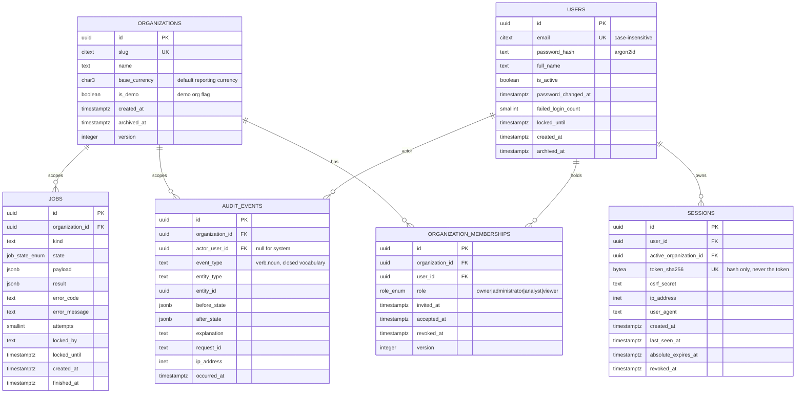
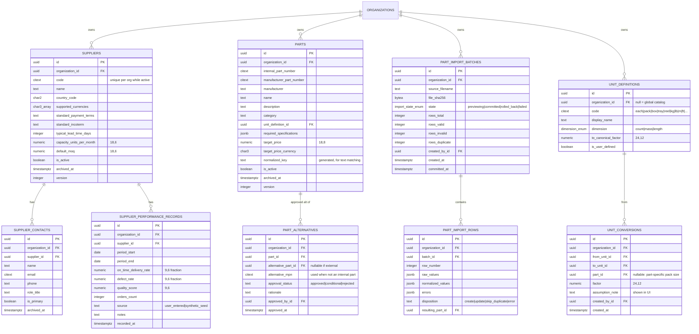
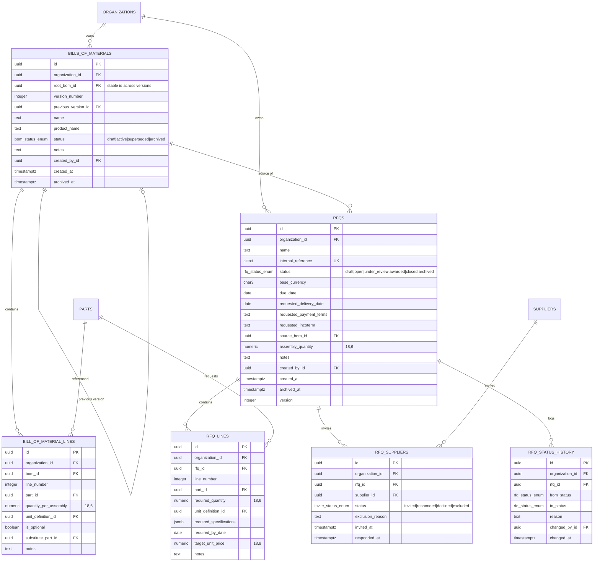
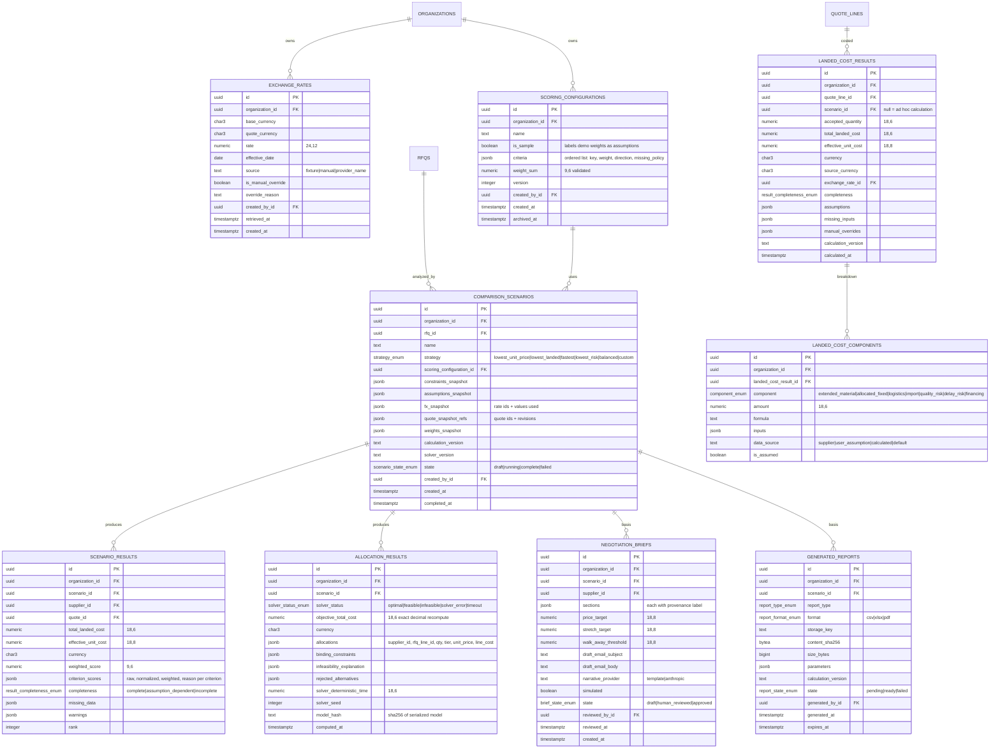

# 02 - Data Model / ERD

Status: **DRAFT**
Covers every entity in `docs/SPEC.md` §Database requirements, plus additions marked **[+]**.

---

## 1. Global conventions

| Concern | Decision |
|---|---|
| Primary keys | `uuid` (v7 preferred for index locality; v4 acceptable). Generated **in the application** via `IdGenerator`, not `gen_random_uuid()`, so seeds and tests are reproducible. |
| Timestamps | `timestamptz`, always UTC, named `*_at`. Server sets them via injected `Clock`. `created_at`/`updated_at` on every mutable table. |
| Money | `NUMERIC(18,6)` for extended/total amounts; **`NUMERIC(18,8)` for unit-price-class columns**; every amount column is accompanied by a `currency` column or an unambiguous currency on the owning row. |
| FX rates | **`NUMERIC(24,12)`** (see `01-architecture.md` §10 D2). |
| Ratios / percentages | `NUMERIC(9,6)` stored as a fraction (0.35 = 35%), never as an integer percent. |
| Quantities | `NUMERIC(18,6)` - quantities are not always integral (kg, m). Integer-only contexts enforce `CHECK (qty = trunc(qty))`. |
| Currency codes | `CHAR(3)` + `CHECK (code ~ '^[A-Z]{3}$')`; validated against an ISO-4217 allowlist in the app. |
| Org ownership | Every business table carries `organization_id uuid NOT NULL` **and** `UNIQUE (organization_id, id)` so children can use composite FKs. |
| Enums | Postgres native `ENUM` types for closed, stable sets (statuses); `text` + `CHECK` for sets likely to grow. Prefer `ENUM`; adding a value is a one-line migration, changing a `CHECK` is not cheaper. |
| Soft delete | `archived_at timestamptz NULL`, `archived_by_id uuid NULL`, `archive_reason text NULL`. **No hard deletes of business data.** |
| Optimistic locking | `version integer NOT NULL DEFAULT 1` on mutable aggregates; `UPDATE ... WHERE version = :expected`. |
| Naming | snake_case, plural tables, `*_id` FKs, indexes `ix_<table>_<cols>`, uniques `uq_`, checks `ck_`, FKs `fk_`. |
| Deletes | `ON DELETE RESTRICT` by default. `CASCADE` only within an aggregate (see §8). |
| JSONB | Allowed **only** for snapshots and provider payloads (immutable, never queried for business rules) and for structured `details` on audit events. Never for anything that needs a constraint. |

**Composite-FK org guard (key proposal).** Child rows reference parents as
`FOREIGN KEY (organization_id, rfq_id) REFERENCES rfqs (organization_id, id)`. This makes a cross-org
reference impossible at the storage layer, not merely unlikely. Cost: one extra unique index per
parent table.

---

## 2. Entity inventory

**SPEC minimum (29):** users, organizations, organization_memberships, suppliers, supplier_contacts,
supplier_performance_records, parts, part_alternatives, bills_of_materials, bill_of_material_lines,
rfqs, rfq_lines, rfq_suppliers, quote_documents, quotes, quote_lines, quote_price_breaks, quote_terms,
extraction_runs, extraction_fields, part_match_candidates, exchange_rates, comparison_scenarios,
scoring_configurations, scenario_results, allocation_results, negotiation_briefs, generated_reports,
audit_events.

**Proposed additions [+] (11):**

| Table | Why it is needed |
|---|---|
| `sessions` | D5 requires server-side sessions in Postgres. |
| `rfq_status_history` | SPEC §5 "preserve meaningful status history". |
| `part_import_batches`, `part_import_rows` | SPEC §3 requires import preview, row-level validation, transactional import, rollback, audit. Preview needs persisted rows before commit. |
| `unit_definitions`, `unit_conversions` | SPEC §10 requires explicit, inspectable conversion assumptions. Hardcoding factors in Python makes "show conversion assumptions" untrue for user-defined units. |
| `landed_cost_results`, `landed_cost_components` | SPEC §Landed-cost engine demands each result persist inputs, formula, assumptions, source, missing info, overrides, timestamp, version. Scenario results alone are too coarse (landed cost is also computed outside a scenario). |
| `jobs` | Async extraction/report/optimization execution (`01-architecture.md` §6). |
| `document_pages` | Page-level text/OCR artifacts + confidence + provenance boxes for review UI. |
| `quote_corrections` | Explicit correction log with before/after per field. Could live in `audit_events`, but the review UI needs to query it cheaply and it is a first-class product feature. |

---

## 3. ERD - Identity, tenancy, audit

`audit_events` is **append-only**: no `updated_at`, no `archived_at`, revoked UPDATE/DELETE grants for
the application role, and a `BEFORE UPDATE OR DELETE` trigger that raises. Partitioning by month is
noted as roadmap, not v0.1.0.

---

## 4. ERD - Suppliers and parts

Notes:
- `parts.normalized_key` is a generated column (lowercase, strip non-alphanumerics) used by the
  normalized-text matching strategy; indexed with `pg_trgm` for fuzzy candidate retrieval.
- `unit_conversions` with a non-null `part_id` expresses "1 reel of THIS part = 5000 each" - the
  common real case. Global rows cover kg↔lb, m↔ft. `assumption_note` satisfies SPEC §10's
  "show conversion assumptions explicitly".

---

## 5. ERD - BOMs and RFQs

**BOM versioning:** copy-on-write. `root_bom_id` is stable; each edit that changes lines creates a new
`bills_of_materials` row with `version_number + 1`, `previous_version_id` set, and the prior row moved
to `superseded`. RFQs reference a *specific version id*, so an RFQ never changes meaning under the
user's feet. `UNIQUE (organization_id, root_bom_id, version_number)`.

---

## 6. ERD - Quotes, documents, extraction, matching

```mermaid
erDiagram
  RFQS ||--o{ QUOTE_DOCUMENTS : receives
  SUPPLIERS ||--o{ QUOTE_DOCUMENTS : sends
  QUOTE_DOCUMENTS ||--o{ DOCUMENT_PAGES : has
  QUOTE_DOCUMENTS ||--o{ EXTRACTION_RUNS : processed_by
  EXTRACTION_RUNS ||--o{ EXTRACTION_FIELDS : produces
  EXTRACTION_RUNS ||--o| QUOTES : materializes
  QUOTES ||--o{ QUOTE_LINES : contains
  QUOTES ||--o| QUOTE_TERMS : has
  QUOTES ||--o| QUOTES : "supersedes"
  QUOTE_LINES ||--o{ QUOTE_PRICE_BREAKS : tiers
  QUOTE_LINES ||--o{ PART_MATCH_CANDIDATES : candidates
  RFQ_LINES ||--o{ PART_MATCH_CANDIDATES : target
  QUOTES ||--o{ QUOTE_CORRECTIONS : corrected_by

  QUOTE_DOCUMENTS {
    uuid id PK
    uuid organization_id FK
    uuid rfq_id FK
    uuid supplier_id FK "nullable until identified"
    text original_filename "sanitized for display only"
    text storage_key "server-generated, never user input"
    text detected_mime "from magic bytes"
    text declared_mime "from client, untrusted"
    bigint size_bytes
    bytea content_sha256 UK "per org"
    document_state_enum state
    text quarantine_reason
    smallint page_count
    uuid uploaded_by_id FK
    timestamptz uploaded_at
    timestamptz archived_at
  }
  DOCUMENT_PAGES {
    uuid id PK
    uuid organization_id FK
    uuid document_id FK
    smallint page_number
    text text_layer "extracted, treated as untrusted data"
    text ocr_text
    numeric ocr_confidence "9,6"
    text preview_storage_key
    text extraction_source "text_layer|ocr|sheet|csv"
  }
  EXTRACTION_RUNS {
    uuid id PK
    uuid organization_id FK
    uuid document_id FK
    integer run_number "1..n per document"
    extraction_state_enum state
    text provider_name "mock|anthropic"
    text provider_model
    boolean simulated "true when mock"
    text schema_version
    text prompt_version
    jsonb provider_request_meta "no document content"
    jsonb raw_response "immutable snapshot"
    numeric overall_confidence "9,6"
    integer fields_requiring_review
    text error_code
    text error_message
    uuid started_by_id FK
    timestamptz started_at
    timestamptz finished_at
    timestamptz superseded_at
  }
  EXTRACTION_FIELDS {
    uuid id PK
    uuid organization_id FK
    uuid extraction_run_id FK
    text field_path "quote.lines[0].unit_price"
    text target_entity "quote|quote_line|quote_terms"
    integer target_line_index
    text field_name
    text raw_value "verbatim from document"
    text normalized_value "typed, validated"
    text value_type "money|decimal|date|text|enum|currency"
    numeric confidence "9,6"
    confidence_band_enum band "high|medium|low"
    boolean requires_confirmation
    boolean is_confirmed
    uuid confirmed_by_id FK
    timestamptz confirmed_at
    smallint source_page
    jsonb source_bbox "provenance for review UI"
    boolean injection_flagged
  }
  QUOTES {
    uuid id PK
    uuid organization_id FK
    uuid rfq_id FK
    uuid supplier_id FK
    uuid source_document_id FK "null for manual entry"
    uuid source_extraction_run_id FK
    integer revision
    uuid supersedes_quote_id FK
    quote_status_enum status "draft|in_review|confirmed|superseded|rejected"
    text quote_number
    date quote_date
    date expiration_date
    char3 currency
    text entry_mode "extracted|manual"
    boolean has_unconfirmed_low_confidence
    jsonb missing_fields "explicit, never invented"
    uuid confirmed_by_id FK
    timestamptz confirmed_at
    timestamptz archived_at
    integer version
  }
  QUOTE_LINES {
    uuid id PK
    uuid organization_id FK
    uuid quote_id FK
    integer line_number
    text quoted_part_number
    text quoted_mpn
    text description
    numeric quantity "18,6"
    uuid unit_definition_id FK
    text raw_unit_of_measure "verbatim"
    numeric unit_price "18,8"
    numeric moq "18,6"
    numeric tooling_cost "18,6"
    numeric setup_cost "18,6"
    numeric packaging_cost "18,6"
    numeric shipping_cost "18,6"
    numeric insurance_cost "18,6"
    numeric other_fixed_cost "18,6"
    numeric tariff_amount "18,6"
    numeric duty_amount "18,6"
    numeric customs_fee "18,6"
    numeric tax_amount "18,6"
    char2 country_of_origin
    integer lead_time_days
    numeric capacity_units "18,6"
    uuid matched_rfq_line_id FK
    match_status_enum match_status "unmatched|auto|confirmed|rejected"
    jsonb missing_fields
    text notes
  }
  QUOTE_PRICE_BREAKS {
    uuid id PK
    uuid organization_id FK
    uuid quote_line_id FK
    numeric min_quantity "18,6"
    numeric max_quantity "18,6 null=open ended"
    numeric unit_price "18,8"
    numeric setup_fee "18,6 optional per tier"
    smallint tier_index
  }
  QUOTE_TERMS {
    uuid id PK
    uuid organization_id FK
    uuid quote_id FK
    text payment_terms
    integer payment_terms_days
    text incoterm
    text shipping_terms
    text warranty_terms
    integer validity_days
    text exceptions
    text exclusions
    text notes
  }
  PART_MATCH_CANDIDATES {
    uuid id PK
    uuid organization_id FK
    uuid quote_line_id FK
    uuid rfq_line_id FK
    uuid part_id FK
    match_strategy_enum strategy "internal_pn|mpn|normalized_text|alternative|fuzzy"
    numeric confidence "9,6"
    text explanation
    integer rank
    boolean is_selected
    boolean human_confirmed
    uuid confirmed_by_id FK
    timestamptz confirmed_at
  }
  QUOTE_CORRECTIONS {
    uuid id PK
    uuid organization_id FK
    uuid quote_id FK
    uuid extraction_field_id FK
    text target_table
    uuid target_row_id
    text field_name
    text before_value
    text after_value
    text reason
    uuid corrected_by_id FK
    timestamptz corrected_at
  }
```

Key points:
- **The document is never the source of truth for business logic.** `extraction_runs` →
  `extraction_fields` (verbatim + normalized + confidence) → *human confirmation* →
  `quotes`/`quote_lines`/`quote_terms` (typed, validated). Only the last tier feeds calculations.
- `extraction_runs.run_number` gives extraction versioning; re-running never mutates a prior run, it
  supersedes it (`superseded_at`).
- `quotes.revision` + `supersedes_quote_id` gives quote versioning; scenarios pin a specific quote id.
- All monetary columns on `quote_lines` are **nullable** - `NULL` means *the supplier did not state
  it*, and is carried through as `MISSING`, never coerced to zero (SPEC §7).
- `injection_flagged` on `extraction_fields` records that the detector saw instruction-like content;
  it is a review signal, not a filter.

---

## 7. ERD - Analysis, results, outputs

**Snapshot rule.** `comparison_scenarios` stores `*_snapshot` JSONB of every input that could change
later: FX rates (id + value), quote ids + revisions, weights, constraints, assumptions, calculation
version, solver version. `scenario_results` / `allocation_results` rows are **immutable**; recomputing
creates a new scenario. This is exactly how SPEC §Scenario comparison's "historical results
reproducible after assumptions change" is satisfied, and it is why those columns are JSONB rather than
FKs alone - a FK would follow the mutation.

---

## 8. Constraint catalogue (selected, non-exhaustive)

**Money and quantity**
- `ck_*_amount_nonneg`: every cost/fee column `>= 0`. Negative fees are a data error; credits are
  modelled as a separate signed `adjustments` concept if ever needed (not in v0.1.0).
- `ck_quote_lines_qty_pos`: `quantity > 0`.
- `ck_rfq_lines_required_qty_pos`: `required_quantity > 0`.
- `ck_unit_price_nonneg`: `unit_price >= 0` (0 is legal: free sample line).
- `ck_currency_iso`: `currency ~ '^[A-Z]{3}$'` on every currency column.
- `ck_exchange_rates_rate_pos`: `rate > 0`.
- `ck_exchange_rates_distinct`: `base_currency <> quote_currency`.

**Price breaks**
- `ck_price_break_range`: `min_quantity > 0 AND (max_quantity IS NULL OR max_quantity >= min_quantity)`.
- `uq_price_break_min`: `UNIQUE (quote_line_id, min_quantity)`.
- **No-overlap:** `EXCLUDE USING gist (quote_line_id WITH =, numrange(min_quantity, COALESCE(max_quantity,'infinity'), '[]') WITH &&)` (requires `btree_gist`). If the maintainer prefers not to enable the extension, fall back to an application-level validator plus a nightly integrity test - but the DB-level exclusion is strictly better and cheap.
- Gap detection (tiers must be contiguous) stays in the application: a gap is a warning, an overlap is an error.

**Scoring**
- `ck_scoring_weight_sum`: weights are stored raw; the app validates `sum > 0`. Weights are normalized
  at calculation time, not at storage time, so the user's raw intent survives.

**Tenancy**
- `uq_<table>_org_id`: `UNIQUE (organization_id, id)` on every org-owned parent.
- Composite FKs on every child (§1).

**Uniqueness with soft delete** - partial indexes so archived rows do not block reuse:
- `uq_suppliers_org_code_active`: `UNIQUE (organization_id, code) WHERE archived_at IS NULL`
- `uq_parts_org_ipn_active`: `UNIQUE (organization_id, internal_part_number) WHERE archived_at IS NULL`
- `uq_rfqs_org_ref_active`: `UNIQUE (organization_id, internal_reference) WHERE archived_at IS NULL`
- `uq_membership_active`: `UNIQUE (organization_id, user_id) WHERE revoked_at IS NULL`
- `uq_quote_documents_org_sha`: `UNIQUE (organization_id, content_sha256)` - duplicate upload detection.
- `uq_extraction_run_number`: `UNIQUE (document_id, run_number)`
- `uq_quote_revision`: `UNIQUE (rfq_id, supplier_id, revision)`
- `uq_exchange_rate_natural`: `UNIQUE (organization_id, base_currency, quote_currency, effective_date, source)`

**State machines** - enforced in the service layer with an explicit transition table; a DB `CHECK`
cannot express "from → to". A trigger is possible but is the wrong place for business rules.

---

## 9. Index plan

Every org-owned table gets `ix_<t>_org (organization_id)` implicitly via `uq_<t>_org_id`. Beyond that:

| Table | Index | Purpose |
|---|---|---|
| `sessions` | `ix_sessions_token (token_sha256)` unique; `ix_sessions_user_active (user_id) WHERE revoked_at IS NULL` | auth hot path |
| `audit_events` | `ix_audit_org_time (organization_id, occurred_at DESC)`; `ix_audit_entity (organization_id, entity_type, entity_id, occurred_at DESC)` | audit report, entity history |
| `suppliers` | `ix_suppliers_org_active (organization_id) WHERE archived_at IS NULL` | list views |
| `parts` | `ix_parts_norm_trgm USING gin (normalized_key gin_trgm_ops)`; `ix_parts_mpn (organization_id, manufacturer_part_number)` | fuzzy + exact matching |
| `rfq_lines` | `ix_rfq_lines_rfq (organization_id, rfq_id, line_number)` | RFQ detail |
| `quote_documents` | `ix_qd_rfq (organization_id, rfq_id, uploaded_at DESC)`; `ix_qd_state (organization_id, state)` | inbox views |
| `extraction_fields` | `ix_ef_run (extraction_run_id)`; `ix_ef_review (extraction_run_id) WHERE requires_confirmation AND NOT is_confirmed` | review queue |
| `quote_lines` | `ix_ql_quote (organization_id, quote_id, line_number)`; `ix_ql_match (organization_id, matched_rfq_line_id)` | comparison joins |
| `quote_price_breaks` | `ix_qpb_line (quote_line_id, min_quantity)` | tier selection |
| `part_match_candidates` | `ix_pmc_line_rank (quote_line_id, rank)`; partial `WHERE NOT human_confirmed` | match review |
| `exchange_rates` | `ix_fx_lookup (organization_id, base_currency, quote_currency, effective_date DESC)` | as-of lookup |
| `comparison_scenarios` | `ix_scen_rfq (organization_id, rfq_id, created_at DESC)` | history |
| `scenario_results` | `ix_sr_scen_rank (scenario_id, rank)` | comparison table |
| `jobs` | `ix_jobs_claim (state, locked_until) WHERE state IN ('queued','running')` | worker claim |
| `generated_reports` | `ix_reports_org_time (organization_id, generated_at DESC)` | downloads list |

Index discipline: add an index only with a query that needs it; every index above maps to a named
screen or job. Verify with `EXPLAIN` fixtures in integration tests for the three heaviest queries
(comparison table, audit report, review queue).

---

## 10. Versioning strategy summary

| Data | Technique | Reproducible how |
|---|---|---|
| BOM | Copy-on-write rows, `root_bom_id` + `version_number` + `previous_version_id` | RFQ points at a version id |
| RFQ status | `rfq_status_history` append-only | full transition log |
| Extraction | `extraction_runs.run_number`, prior runs `superseded_at`, never mutated | any run re-openable |
| Corrections | `quote_corrections` before/after + `audit_events` | replayable |
| Quote | `revision` + `supersedes_quote_id` | scenario pins a revision |
| Scoring config | `scoring_configurations.version`; scenarios store `weights_snapshot` | snapshot wins over live config |
| FX | Rates are append-only per (pair, date, source); scenarios store `fx_snapshot` | pinned |
| Calculation logic | `calculation_version` semver recorded on every result; versioned implementations registered in code | old version re-executable |
| Solver | `solver_version` + `solver_seed` + `model_hash` | model reconstructable and comparable |
| Reports | Immutable artifacts in storage + `content_sha256` | byte-identical retrieval |

Mutable aggregates additionally carry `version integer` for optimistic concurrency (lost-update
prevention on the review screens, where two analysts editing one quote is realistic).

---

## 11. Archive / soft-delete strategy

- **Never hard-delete** users, organizations, suppliers, parts, BOMs, RFQs, quotes, documents,
  scenarios, briefs, reports, audit events.
- `archived_at` + `archived_by_id` + `archive_reason`. Repositories exclude archived rows by default;
  an explicit `include_archived=True` is required, and list endpoints expose `?include_archived=`.
- Archiving is **blocked** when a non-archived dependent exists that would be rendered meaningless
  (e.g. archiving a supplier referenced by an open RFQ) - returns `409 conflict` with the blockers
  listed. Archiving a supplier with only historical scenarios is allowed; historical scenarios keep
  working because they hold snapshots.
- Un-archive is permitted for `owner`/`administrator` and is itself audited.
- Hard delete exists only for: expired `sessions`, expired `generated_reports` artifacts (row kept,
  blob purged, `storage_key` nulled with `purged_at` set), and `part_import_rows` of rolled-back
  batches older than N days. Each purge writes an audit event.
- **Cascades:** `ON DELETE CASCADE` only inside an aggregate where the child cannot exist alone
  (`quote_lines`→`quote_price_breaks`, `extraction_runs`→`extraction_fields`,
  `landed_cost_results`→`landed_cost_components`, `part_import_batches`→`part_import_rows`). Everything
  else is `RESTRICT`. Since business rows are never deleted, cascades are effectively a safety net for
  test teardown and purges.

---

## 12. Spec gaps and open questions on the data model

1. **Multi-currency within one quote.** SPEC puts `currency` on the quote. Real quotes sometimes price
   freight in a different currency. Modelled as quote-level currency for v0.1.0; per-line currency
   override is a schema change if the maintainer wants it - cheaper to decide now than later.
2. **Tax vs tariff vs duty** are separate columns but the SPEC never says whether tax is recoverable
   (VAT) - recoverable tax should not be in landed cost. Proposed: `tax_is_recoverable boolean` on
   `quote_terms`, defaulting to `false`, surfaced as an assumption. **Needs a decision.**
3. **Quantity granularity.** `NUMERIC(18,6)` allows fractional units; the optimizer works in integers.
   Proposed: `unit_definitions.is_integral` drives whether the optimizer may split, and non-integral
   parts are scaled by their canonical factor before solving.
4. **Supplier identity across orgs.** Suppliers are org-owned with no global registry. Two orgs quoting
   the same vendor are unrelated rows. Correct for isolation; worth stating in the README so it is not
   read as a bug.
5. **`supplier_performance_records` period overlap** is not constrained. Overlapping periods make
   "on-time delivery rate" ambiguous. Proposed: exclusion constraint on `(supplier_id, daterange)`.
6. **Attachment of a quote to multiple RFQs** (a supplier sends one PDF covering two RFQs) is not
   supported. Flagged as an accepted limitation for v0.1.0.
7. **`citext` requires the `citext` extension**; `pg_trgm` and `btree_gist` likewise. All three are in
   contrib and available in both `pgserver` and the GitHub Actions `postgres` image, but the first
   migration must `CREATE EXTENSION IF NOT EXISTS` them and the deployment doc must say so.
