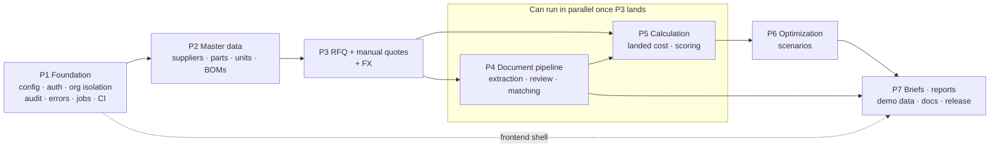

# 09 - Task Decomposition, Dependencies, and File Ownership

Status: **DRAFT FOR PRINCIPAL REVIEW**

> **Assumption flagged up front:** `docs/SPEC.md` does not define numbered phases. The seven phases
> below are my construction, derived from the SPEC's required end-to-end workflow and its dependency
> structure. If the principal has a different phase model, the task list survives; only the grouping
> changes.

Task sizing: **S** ≤ half a day, **M** ≈ 1 day, **L** ≈ 2-3 days for a competent junior with the
contracts already in place. Every task states its acceptance criteria in testable terms because
"done" must not be a matter of opinion.

---

## 1. Phase overview

| Phase | Theme | Exit criterion |
|---|---|---|
| **1** | Foundation: repo, config, DB, auth, org isolation, audit, error envelope, CI | A junior can add a CRUD endpoint and it is automatically org-isolated, audited, role-checked, and covered by the route matrix. |
| **2** | Master data: suppliers, parts, imports, units, BOMs | Seedable master data with transactional CSV/XLSX import. |
| **3** | RFQ and quotes (manual path) | Full workflow to a comparable quote **without any document processing**. |
| **4** | Document pipeline: upload, extraction, review, correction, matching | All four fixture formats reach a confirmed quote through human review. |
| **5** | Calculation: landed cost, FX, units, price breaks, scoring | Hand-verified numbers with full provenance and completeness semantics. |
| **6** | Optimization and scenarios | Honest solver statuses, split orders, infeasibility explanations, reproducible history. |
| **7** | Briefs, reports, demo dataset, docs, hardening, release | SPEC §Definition of done satisfied end to end. |

Phase 3 before Phase 4 is deliberate: building the *manual* quote path first means Phases 5 and 6 can
start against real data while the document pipeline is still being built, and it guarantees the
product is usable even when extraction fails - which the SPEC implicitly requires by listing manual
entry as a supported format.

---

## 2. Phase 1 - Foundation

| ID | Task | Size | Depends on | Owner | Acceptance |
|---|---|---|---|---|---|
| 1.1 | Repo skeleton, monorepo dirs, MIT licence, `.gitignore`, `.env.example`, issue/PR templates | S | - | **P** | clean clone has no secrets; gitleaks passes |
| 1.2 | `backend/pyproject.toml` (uv), pinned deps, ruff/mypy config, `uv.lock` | S | 1.1 | **P** | `uv sync` works on macOS arm64 with Python 3.12 |
| 1.3 | `app/core/config.py` typed settings + fail-fast validation | S | 1.2 | **P** | app refuses to start with `EXTRACTION_PROVIDER=anthropic` and no key |
| 1.4 | `app/core/money.py`, `clock.py`, `ids.py`, decimal context + traps | M | 1.2 | **P** | unit tests for quantization, `float` banned by lint |
| 1.5 | `app/core/errors.py` + exception handlers + error envelope | M | 1.3 | **P** | every error code of `03-…` §3 rendered correctly |
| 1.6 | `app/core/logging.py` structured logs + `request_id` middleware | S | 1.3 | D | request id in response header and log line |
| 1.7 | SQLAlchemy base, mixins (`OrgOwned`, `Timestamped`, `SoftDelete`, `Versioned`), session/UoW dependency | M | 1.2 | **P** | mixins used by a scratch model; `expire_on_commit=False` |
| 1.8 | Alembic setup + migration 0001: extensions, `organizations`, `users`, `organization_memberships`, `sessions`, `audit_events` (+ append-only grants/trigger) | M | 1.7 | **P** | up/down on empty DB; audit UPDATE fails |
| 1.9 | `repositories/base.py` `OrgScopedRepository` + `OrgIsolationViolation` | M | 1.7 | **P** | forgetting a filter in a subclass is caught by a test |
| 1.10 | Auth: argon2id, session create/rotate/expire/revoke, login/logout endpoints | L | 1.8 | **P** | token hash only in DB; rotation on login |
| 1.11 | `api/deps.py`: `CurrentPrincipal`, `OrgScope`, `require_roles`, CSRF + Origin check | L | 1.10 | **P** | body `organization_id` ignored + logged |
| 1.12 | Permission matrix module + coverage test | M | 1.11 | **P** | new route without a declaration fails CI |
| 1.13 | Route-matrix org-isolation test harness | M | 1.11 | **P** | passes for the auth/org routes; extensible |
| 1.14 | `AuditRecorder` service + audit read endpoints | M | 1.8, 1.11 | D | one event per mutation, same transaction |
| 1.15 | Security headers, CORS, rate limiting middleware | M | 1.5 | **P** | header assertions; strict CSP with no `unsafe-inline` |
| 1.16 | `jobs` table + inline/thread runner + `/jobs/{id}` | M | 1.8 | **P** | `JOB_RUNNER=inline` runs synchronously |
| 1.17 | Providers registry + `StorageProvider` (filesystem + S3) + `Clock`/`IdGenerator` wiring | M | 1.3 | **P** | key regex enforced; both providers pass one shared test suite |
| 1.18 | `pytest` conftest: DB resolution (env → pgserver → compose), transaction rollback, fakes | M | 1.8 | **P** | suite runs on the principal's machine with no Docker |
| 1.19 | Frontend scaffold: Vite, TS strict, TanStack Query/Router, layout shell, auth pages | L | - | **P** (shell) / D (pages) | login works against the real API |
| 1.20 | `openapi-typescript` generation + typed fetch client + error mapping | M | 1.5, 1.19 | **P** | CI fails on schema/type drift |
| 1.21 | Design tokens, base component set, money/date formatting utils | M | 1.19 | **P** (tokens) / D (components) | money rendered from strings, never `Number()` |
| 1.22 | CI workflow with the eight jobs of `08-…` §8 | M | 1.18, 1.19 | **P** | green on a clean clone |
| 1.23 | `docker-compose.yml` (postgres + minio) + `scripts/dev_db.py` | S | 1.18 | D | both dev paths documented and working |

Phase 1 is deliberately principal-heavy. Every contract established here is inherited by 100+ later
tasks; a wrong `OrgScope` or error envelope is a repo-wide refactor in week four.

---

## 3. Phase 2 - Master data

| ID | Task | Size | Depends on | Owner |
|---|---|---|---|---|
| 2.1 | Migration: `suppliers`, `supplier_contacts`, `supplier_performance_records` (+ composite org FKs, partial uniques) | M | 1.8 | **P** (review) / D (write) |
| 2.2 | Supplier model/schema/repo/service/routes + tests | L | 2.1, 1.9 | D |
| 2.3 | Supplier contacts + performance records CRUD | M | 2.2 | D |
| 2.4 | Archive/unarchive with blocker detection (409 + `blockers[]`) | M | 2.2 | D |
| 2.5 | Migration + CRUD: `unit_definitions`, `unit_conversions`; global unit catalogue seed | M | 1.8 | D |
| 2.6 | Migration: `parts`, `part_alternatives`, `normalized_key` generated column, trigram index | M | 2.5 | **P** (review) / D |
| 2.7 | Parts CRUD + alternatives + search | L | 2.6 | D |
| 2.8 | CSV/XLSX import: parser, header validation, row validation, duplicate detection | L | 2.7 | D |
| 2.9 | Import preview batch → commit → rollback, transactional, audited | L | 2.8, 1.16 | D |
| 2.10 | Migration + CRUD: `bills_of_materials`, `bill_of_material_lines`, copy-on-write versioning | L | 2.7 | D |
| 2.11 | Frontend: suppliers list/detail (TanStack Table), parts list/detail, import wizard, BOM editor | L×3 | 2.2-2.10, 1.20 | D |

Acceptance for the phase: import 200 rows with 3 duplicates and 2 invalid rows → preview shows exact
counts and per-row errors; commit is all-or-nothing; an induced failure leaves zero new `parts` rows;
one audit event per import.

---

## 4. Phase 3 - RFQ and manual quotes

| ID | Task | Size | Depends on | Owner |
|---|---|---|---|---|
| 3.1 | Migration: `rfqs`, `rfq_lines`, `rfq_suppliers`, `rfq_status_history` | M | 2.10 | D |
| 3.2 | RFQ CRUD + BOM explosion into lines | L | 3.1 | D |
| 3.3 | Status transition table + `POST /status` + history | M | 3.1 | **P** (table) / D |
| 3.4 | Supplier invitation / exclusion with reasons | M | 3.1 | D |
| 3.5 | Migration: `quotes`, `quote_lines`, `quote_price_breaks`, `quote_terms` (+ break exclusion constraint) | M | 3.1 | **P** (review) / D |
| 3.6 | Manual quote entry API + revision/supersede logic | L | 3.5 | D |
| 3.7 | Price-break CRUD with overlap/gap validation | M | 3.5 | D |
| 3.8 | Migration + CRUD: `exchange_rates`, fixture FX provider, manual override with reason | M | 1.17 | D |
| 3.9 | Frontend: RFQ workspace, line editor, invitations, manual quote form, price-break grid, FX admin | L×3 | 3.2-3.8 | D |

Acceptance: a user can go from empty org to two comparable quotes on one RFQ without touching a
document, and every status change is in `rfq_status_history`.

---

## 5. Phase 4 - Document pipeline

| ID | Task | Size | Depends on | Owner |
|---|---|---|---|---|
| 4.1 | Migration: `quote_documents`, `document_pages`, `extraction_runs`, `extraction_fields`, `quote_corrections`, `part_match_candidates` | M | 3.5 | **P** (review) / D |
| 4.2 | Upload endpoint: streamed size cap, magic bytes, filename policy, dedupe, quarantine | L | 4.1, 1.17 | **P** | 
| 4.3 | Per-format validators (PDF/PNG/JPEG/CSV/XLSX) incl. bombs, entities, encryption | L | 4.2 | **P** (security core) / D (per format) |
| 4.4 | Text/table acquisition: pypdf, pdfplumber, pypdfium2 raster, openpyxl, csv sniffing → `document_pages` | L | 4.3 | D |
| 4.5 | `OcrProvider` interface + mock + optional rapidocr adapter | M | 4.4 | D |
| 4.6 | Extraction schema (versioned Pydantic) + `ExtractionProvider` interface | M | 4.1 | **P** |
| 4.7 | `MockExtractionProvider` keyed by SHA-256 + fixture generator + golden JSONs | L | 4.6 | D |
| 4.8 | Anthropic adapter (optional, no tools, nonce-delimited data envelope, prompt versioned) | M | 4.6 | **P** |
| 4.9 | Validation ladder: schema → type → business; per-field failures | L | 4.6 | **P** (ladder) / D (rules) |
| 4.10 | Confidence model, banding, critical-field policy, propagation flags | M | 4.9 | **P** |
| 4.11 | Injection canary detector + flagging + security audit event | M | 4.4 | **P** |
| 4.12 | Extraction-run state machine + job wiring + retries + supersession | L | 4.9, 1.16 | D |
| 4.13 | Field review/correction API + `quote_corrections` + audit | L | 4.12 | D |
| 4.14 | Materialization: run → quote/lines/breaks/terms in one transaction | L | 4.13, 3.6 | D |
| 4.15 | Part matching: five strategies, deterministic ordering, explanations | L | 4.14, 2.7 | **P** (interface) / D (strategies) |
| 4.16 | Match confirmation API + stickiness | M | 4.15 | D |
| 4.17 | Frontend: upload UI, document viewer with page previews + bbox highlight, review/correction screen, match confirmation screen | L×4 | 4.2-4.16 | D |
| 4.18 | Document content/preview streaming endpoints with security headers | M | 4.2 | **P** |

Acceptance: all four fixture formats plus the injection fixture reach a confirmed quote; the injection
fixture yields the correct price, a flag, a banner, and a security audit event.

---

## 6. Phase 5 - Calculation and scoring

| ID | Task | Size | Depends on | Owner |
|---|---|---|---|---|
| 5.1 | `app/domain/landed_cost/contracts.py` - `Quantified`, `Provenance`, inputs/results, `CALCULATION_VERSION` | M | 1.4 | **P** |
| 5.2 | Unit normalization domain module | M | 5.1, 2.5 | D |
| 5.3 | FX normalization domain module (as-of, inverse, triangulation flag) | M | 5.1, 3.8 | D |
| 5.4 | Price-break selection module + boundary tests | M | 5.1, 3.7 | D |
| 5.5 | `LandedCostCalculatorV1` - seven components, quantization policy, completeness | L | 5.1-5.4 | **P** (component skeleton) / D (components) |
| 5.6 | Hand-verified test suite incl. the §9 worked example + hypothesis properties | L | 5.5 | D |
| 5.7 | Migration + persistence: `landed_cost_results`, `landed_cost_components` | M | 5.5 | D |
| 5.8 | `POST /landed-costs:preview` + persisted calculation endpoints | M | 5.7 | D |
| 5.9 | Scoring contracts + `ScorerV1` (normalization, missing policies, zero weights, outliers, exclusions) | L | 5.1 | **P** (contracts) / D |
| 5.10 | Migration + CRUD `scoring_configurations` + seeded sample weights labelled `is_sample` | M | 5.9 | D |
| 5.11 | Calculation-version registry + historical golden tests | M | 5.5, 5.9 | **P** |
| 5.12 | Frontend: landed-cost breakdown panel (formula, inputs, provenance, missing), weight editor, comparison table | L×3 | 5.8-5.10 | D |

Acceptance: the worked example reproduces exactly; a missing freight cost produces `incomplete` plus a
not-like-for-like warning rather than a silently cheaper supplier.

---

## 7. Phase 6 - Optimization and scenarios

| ID | Task | Size | Depends on | Owner |
|---|---|---|---|---|
| 6.1 | Migration: `comparison_scenarios`, `scenario_results`, `allocation_results` | M | 5.7 | D |
| 6.2 | Scenario creation with full input snapshotting (FX, quotes, weights, constraints, assumptions) | L | 6.1 | **P** |
| 6.3 | Pre-solve eligibility filtering with reason strings | M | 6.2 | D |
| 6.4 | CP-SAT model builder: variables, tier linking, constraints | L | 6.3 | **P** |
| 6.5 | Integer scaling + bound guard + exact Decimal recomputation | M | 6.4 | **P** |
| 6.6 | Determinism: single worker, seed, deterministic time, sorted inputs, `model_hash`, tie-break with bound assertion | M | 6.4 | **P** |
| 6.7 | Status mapping + honest reporting | S | 6.4 | **P** |
| 6.8 | Infeasibility: pre-solve checks, assumption-literal cores, minimal relaxation search | L | 6.4 | **P** (cores) / D (pre-solve messages) |
| 6.9 | Rejected alternatives: per-supplier solves + next-best split + binding constraints | M | 6.4 | D |
| 6.10 | Scenario strategies (6 variants) | M | 6.4 | D |
| 6.11 | Scenario clone + reproducibility test across an assumption change | M | 6.2 | D |
| 6.12 | 20-case optimization test matrix | L | 6.4-6.9 | D |
| 6.13 | Frontend: scenario builder (constraints, locks, exclusions), allocation view, infeasibility explainer, scenario history | L×3 | 6.2-6.11 | D |

Acceptance: every one of the 20 matrix cases passes; an infeasible scenario names the conflicting
groups and a numeric relaxation threshold.

---

## 8. Phase 7 - Briefs, reports, demo data, docs, release

| ID | Task | Size | Depends on | Owner |
|---|---|---|---|---|
| 7.1 | Migration + `negotiation_briefs`; brief assembly from confirmed data only | L | 6.9 | **P** (provenance model) / D |
| 7.2 | `AiNarrativeProvider` template default + optional Anthropic + **numeric-token cross-check** | L | 7.1 | **P** |
| 7.3 | Brief review workflow; email draft returned as text; **no send endpoint** | M | 7.1 | D |
| 7.4 | Migration + `generated_reports`; CSV/XLSX exporters with formula-injection escaping | L | 6.9 | D |
| 7.5 | PDF renderer (ReportLab): comparison, CFO recommendation, brief, scenario summary, audit history | L×2 | 7.4 | D |
| 7.6 | Report content requirements: methodology, assumptions, missing data, disclaimer, versions | M | 7.5 | **P** (template) / D |
| 7.7 | Synthetic seed dataset meeting every SPEC §Synthetic dataset requirement, idempotent | L | all | **P** (design) / D (build) |
| 7.8 | Fixture document generator + committed goldens (may land in Phase 4; verified here) | M | 4.7 | D |
| 7.9 | E2E full-workflow spec + supporting specs | L | all | D |
| 7.10 | Docs: ARCHITECTURE, DATABASE, METHODOLOGY, DOCUMENT_PIPELINE, OPTIMIZATION, SECURITY, DATA_DICTIONARY, DEPLOYMENT, ROADMAP | L×2 | all | **P** (SECURITY, METHODOLOGY, OPTIMIZATION) / D (rest) |
| 7.11 | README with screenshots/GIF, architecture diagram, ERD, setup, env vars, limitations | L | 7.10 | **P** |
| 7.12 | Hardening pass: dependency audit, licence check, header review, rate-limit tuning, error redaction sweep | M | all | **P** |
| 7.13 | Optional Postgres RLS layer | M | all | **P** |
| 7.14 | v0.1.0 release notes, CI green, acceptance walkthrough | S | all | **P** |

---

## 9. Dependency graph (phase level)

Critical path: **P1 → P2 → P3 → P5 → P6 → P7**. The document pipeline (P4) is expensive but is *not*
on the critical path for calculation and optimization, because manual quote entry lands in P3. That is
the main scheduling reason for the P3/P4 ordering.

Parallelization for two or three implementers after P1: one on P2/P3 (CRUD-heavy), one on P4
(pipeline), one on P5/P6 (pure domain, needs almost no DB). The pure-domain work has the fewest file
conflicts and is the best fit for the least-experienced implementer once the contracts exist.

---

## 10. Draft FILE-OWNERSHIP MAP

**P = principal-owned** (only the principal writes; others propose diffs in review).
**D = delegable.** **R = delegable but principal review required before merge.**

### Reserved for the principal

| Path | Why |
|---|---|
| `backend/src/app/core/**` | money/Decimal policy, security primitives, error envelope, clock/ids - every other file depends on these semantics |
| `backend/src/app/api/deps.py` | authentication, `OrgScope`, role guard, CSRF - the whole authorization model |
| `backend/src/app/api/permissions.py` | the permission matrix that drives tests and docs |
| `backend/src/app/repositories/base.py` | org isolation control #2 |
| `backend/src/app/models/base.py`, `mixins.py` | org ownership, soft delete, versioning conventions |
| `backend/src/app/schemas/base.py`, `common.py`, `errors.py`, `pagination.py` | the shared API contract |
| `backend/src/app/domain/**/contracts.py` (all) | calculator, scorer, optimizer, matcher, provider interfaces |
| `backend/src/app/domain/landed_cost/quantization.py` | rounding policy |
| `backend/src/app/domain/optimization/model_builder.py`, `scaling.py`, `determinism.py` | correctness of the solver contract |
| `backend/src/app/domain/registry.py` | calculation-version registry |
| `backend/src/app/providers/__init__.py`, `*/base.py` | provider interfaces and selection |
| `backend/src/app/providers/extraction/prompt/**` | prompt text, `prompt_version`, injection envelope |
| `backend/src/app/services/audit.py` | audit semantics |
| `backend/src/app/jobs/runner.py` | concurrency and transaction boundaries |
| `backend/migrations/versions/0001_*.py` and any migration touching tenancy/composite FKs | schema-level isolation |
| `backend/tests/conftest.py`, `tests/integration/test_org_isolation_matrix.py`, `tests/security/**` | the guarantees everyone else inherits |
| `frontend/src/api/client.ts`, `frontend/src/api/schema.d.ts` (generated), `frontend/src/lib/money.ts`, `format.ts` | typed contract and money rendering |
| `frontend/src/styles/tokens.css`, `frontend/src/components/ui/**` (base primitives) | design tokens and base components |
| `frontend/src/routes/__root.tsx`, auth guards | routing and auth shell |
| `pyproject.toml`, `uv.lock`, `package.json`, `package-lock.json`, `tsconfig.json`, `vite.config.ts`, `alembic.ini` | dependency and build policy (licence trap in `01-…` §9) |
| `.github/workflows/**`, `.pre-commit-config.yaml`, `docker-compose.yml`, `.env.example` | CI and environment reproducibility |
| `docs/SPEC.md`, `docs/SECURITY.md`, `docs/METHODOLOGY.md`, `docs/OPTIMIZATION.md`, `README.md` | claims made to the outside world |
| `docs/openapi.json` (committed snapshot) | contract of record |

### Delegable

| Path | Notes |
|---|---|
| `backend/src/app/api/v1/<resource>.py` | thin routes against principal-owned deps |
| `backend/src/app/schemas/<resource>.py` | **R** - reviewed for decimal-as-string and missing-field conventions |
| `backend/src/app/services/<resource>_service.py` | must call `AuditRecorder` |
| `backend/src/app/repositories/<resource>_repository.py` | must extend `OrgScopedRepository` |
| `backend/src/app/models/<table>.py` | **R** - reviewed for org FK, constraints, indexes |
| `backend/src/app/domain/**/` implementations behind contracts | the best delegable work: pure, testable, high-value |
| `backend/src/app/providers/*/mock_*.py`, `filesystem.py`, `s3.py` | against principal-owned interfaces |
| `backend/src/app/exports/**` | **R** for the formula-escaping helper |
| `backend/src/app/seed/**` | **R** - must satisfy the SPEC dataset checklist |
| `backend/migrations/versions/**` (non-tenancy) | **R** - every migration reviewed, autogenerate never merged unread |
| `backend/tests/unit/**`, `tests/integration/<feature>/**` | |
| `frontend/src/routes/**` (feature pages), `features/**`, `components/<feature>/**` | |
| `frontend/src/hooks/**` (TanStack Query hooks) | |
| `e2e/**` specs other than the full-workflow spec | |
| `docs/ARCHITECTURE.md`, `DATABASE.md`, `DOCUMENT_PIPELINE.md`, `DATA_DICTIONARY.md`, `DEPLOYMENT.md`, `ROADMAP.md`, `CONTRIBUTING.md` | **R** |

### Working rules
1. A delegable task that needs a change to a **P** file becomes a request in the PR description; the
   principal makes the change. This keeps contract churn visible.
2. No delegable PR may add a dependency, a migration touching tenancy, or a new route without a
   permission-matrix entry.
3. Every PR runs the full CI matrix; the route-matrix and contract-drift jobs are non-negotiable.
4. Migration files are append-only once merged; fixes are new migrations.

---

## 11. Missing edge cases and gaps in the SPEC

Consolidated from all nine documents. Each needs a ruling or an explicit "accepted limitation".

**Commercial / domain**
1. **All-units vs incremental price breaks** - assumed all-units; changes the MILP if wrong.
2. **Scrap / yield loss** (buy 1 050 to receive 1 000 good) - a real landed-cost driver, entirely absent.
3. **Minimum order value / small-order surcharges** - common on real quotes, no field for them.
4. **Volume-stepped freight** (a second container at 1 200 units) - modelled as linear; not true.
5. **Recoverable tax (VAT)** - including it distorts comparison; SPEC does not distinguish.
6. **Duty basis (FOB vs CIF)** - changes import cost materially; SPEC is silent.
7. **Payment terms as a financing *benefit*** - SPEC lists financing as a cost only; Net-60 would rank worse than Net-30 under a strict reading.
8. **Quote expiry** - SPEC captures `expiration_date` but never says what happens when a scenario uses an expired quote. Proposed: allowed with a prominent warning, blocked from "recommended" status.
9. **Currency of fixed costs** differing from line pricing.
10. **Multi-currency or multi-RFQ documents**.
11. **Supplier capacity shared across parts** vs per-line.
12. **Lead time vs required-by date** - no rule for partial-lateness tolerance.
13. **Tie-breaking between equal-cost allocations** - SPEC demands determinism but gives no preference rule; I proposed fewest-suppliers-then-lexicographic.

**Process / data**
14. **Who may confirm a low-confidence value** - should a `viewer` ever confirm? (No, per my matrix.) Should confirmation require a different role than upload? (Segregation of duties is arguably right for money fields; not specified.)
15. **Re-extraction after corrections** - carry-forward behaviour undefined; I proposed suggest-not-apply.
16. **Quote revisions** - no auto-detection rule.
17. **Concurrent editing** of one quote by two analysts - SPEC silent; I proposed optimistic locking.
18. **Data retention / deletion requests** vs "preserve originals forever".
19. **Demo-org reset semantics** and who may trigger them.
20. **Password reset** - no mail provider is specified, so there is no recovery flow.
21. **Membership invitation flow** - SPEC lists memberships but no invite/accept mechanism.
22. **Audit-event retention and volume** - append-only forever with no partitioning strategy.
23. **Report expiry/purge** vs the audit requirement to preserve generated reports.
24. **Non-ASCII/RTL part numbers and supplier names** through PDF export (font coverage in ReportLab is a real constraint).
25. **Time zones for `due_date` / `required_by_date`** - dates are stored naive; "due 2026-09-01" in which zone matters for a global supplier base.
26. **Approved design direction uses a Google Fonts CDN**, which conflicts with the strict CSP and the no-network-egress demo/E2E requirement. Self-host via `@fontsource`. See `01-architecture.md` §9.1.
27. **Confidence bands differ** between the design system (`0.9/0.6`) and `04-document-pipeline.md` (`0.95/0.60`). One constant, one source of truth.

---

## 12. Top risks

| # | Risk | Impact | Likelihood | Mitigation |
|---|---|---|---|---|
| 1 | **Scope.** ~30 entities, ~120 endpoints, 4 document formats, a solver, 5 report types, 9 docs. This is a multi-month build presented as one spec. | Unfinished repo, worse than a smaller finished one | High | Phase gates with hard exit criteria; the P3-before-P4 ordering so the product is demonstrable early; be willing to ship P4 with 2 formats and label the rest roadmap |
| 2 | **Solver nondeterminism** silently breaking the reproducibility claim | Core promise falsified | Medium | single worker + seed + deterministic time + `model_hash` assertions (task 6.6) - and these must land with the first solve, not later |
| 3 | **Environment divergence** between the principal's no-Docker machine and CI/other devs | "Works on my machine", late surprises | Medium-High | one DB-resolution code path; CI is authoritative; MinIO job so the S3 path is real; verify Playwright arm64 in Phase 1 |
| 4 | **Org-isolation regression** as endpoint count grows | Spec-breaking security failure | Medium | five-layer defence, composite org FKs, route-matrix test that fails on undeclared routes |
| 5 | **Decimal leakage to float** at a boundary (JSON, chart library, CSV, ORM) | Wrong money, silently | Medium | strings over the wire, lint ban, ORM `asdecimal`, explicit tests at each boundary |
| 6 | **Licence contamination** (PyMuPDF AGPL, GPL fuzzy libs) in an MIT repo | Legal/credibility problem in a portfolio piece | Medium | pypdfium2 + rapidfuzz + ReportLab; CI licence gate |
| 7 | **Extraction quality with the mock provider looks fake**, or with the real provider is unreproducible | Demo credibility | Medium | goldens keyed by hash; honest "Simulated AI" labelling; real provider strictly opt-in |
| 8 | **Prompt injection**, or the AI narrative inventing numbers | Directly violates SPEC | Medium | structural containment (no tools/network), validation ladder, mandatory confirmation, numeric-token cross-check |
| 9 | **Frontend/backend contract drift** | Runtime type errors, wasted days | Medium-High | generated types + committed `openapi.json` + CI drift job |
| 10 | **Migration/model drift** | Migrations succeed but the DB does not match the models | Medium | autogenerate-produces-empty-diff test; up/down in CI |
| 11 | **PDF report effort underestimated** | Phase 7 overrun | Medium-High | ReportLab templates started in Phase 5 as a spike; CSV/XLSX first, PDF last |
| 12 | **Junior implementers bypassing contracts** under time pressure | Erosion of every guarantee above | Medium | ownership map, import-linter, review rules, tests that fail on omission rather than relying on review |

---

## 13. Complete list of assumptions I made

1. Phases 1-7 are my construction; the SPEC has none.
2. Price breaks are all-units discounts.
3. One currency per quote; RFQ base currency is the comparison currency.
4. Fixed costs are charged fully to the awarded quantity (no amortization over forecast volume).
5. Financing is signed relative to a baseline payment term (benefit for longer terms).
6. Recoverable tax excluded by default; duty basis defaults to material + logistics.
7. Concentration limits default to a cost basis, not a quantity basis.
8. Missing criterion values default to weight renormalization, not worst-case.
9. All-equal criterion values score 1.0 for everyone.
10. `viewer` may read and download but never confirm, calculate, or generate.
11. Cross-org access returns 404, never 403.
12. Demo access is a seeded `analyst` account, no self-service signup, no email flows in v0.1.0.
13. Long-running work is a DB-backed job with an in-process runner; no Redis/Celery.
14. Single-node deployment; no horizontal scaling requirement.
15. OCR ships mock-only by default; the real adapter is an optional extra.
16. Manual quote entry is built before document extraction.
17. Extraction re-runs suggest, rather than reapply, prior corrections.
18. Optimistic concurrency (`If-Match`) is used on mutable aggregates.
19. Audit events are immutable and never partitioned in v0.1.0.
20. `docs/planning/**` is the only path I have written to, per my instructions; no code, config, or git
    state has been created or modified.
